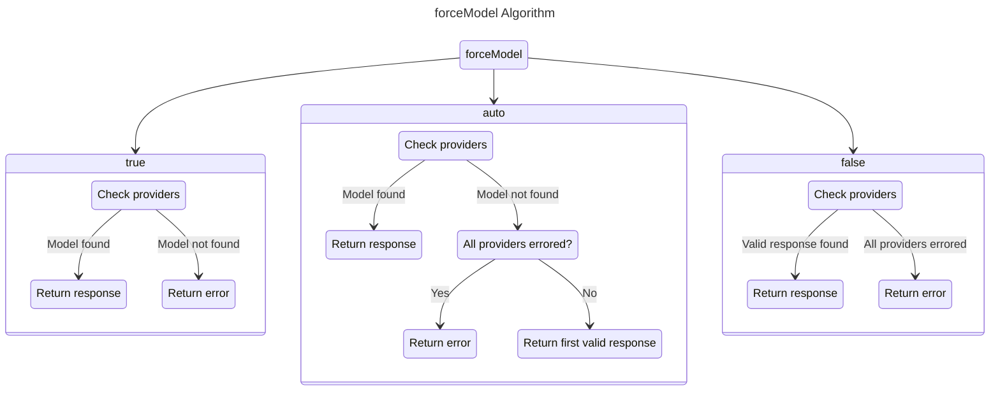

import { Callout } from 'nextra/components'

# Model Forcing

<Callout type="warning" emoji="⚠️">
    This only works for OpenAI endpoints!
</Callout>

There is an optional query parameter for OpenAI endpoints: `forceModel`

This parameter can only be `true{:json}`, `auto` or `false{:json}`. Defaults to `auto`.

- If it is `true{:json}`, the API will try to find responses with your requested model.
- If it is `auto`, the API will try to find responses with your requested model. If not found, will return first valid response.
- If it is `false{:json}`, the API will return first valid response.



## Example Request Body With `forceModel`

```json {2}
{
	"forceModel": true,
	"messages": [
		{
			"role": "user",
			"content": "Who are you?"
		}
	]
}
```